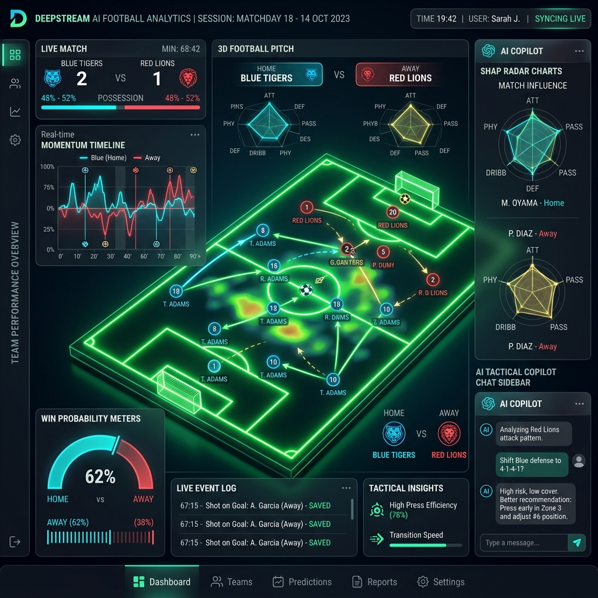
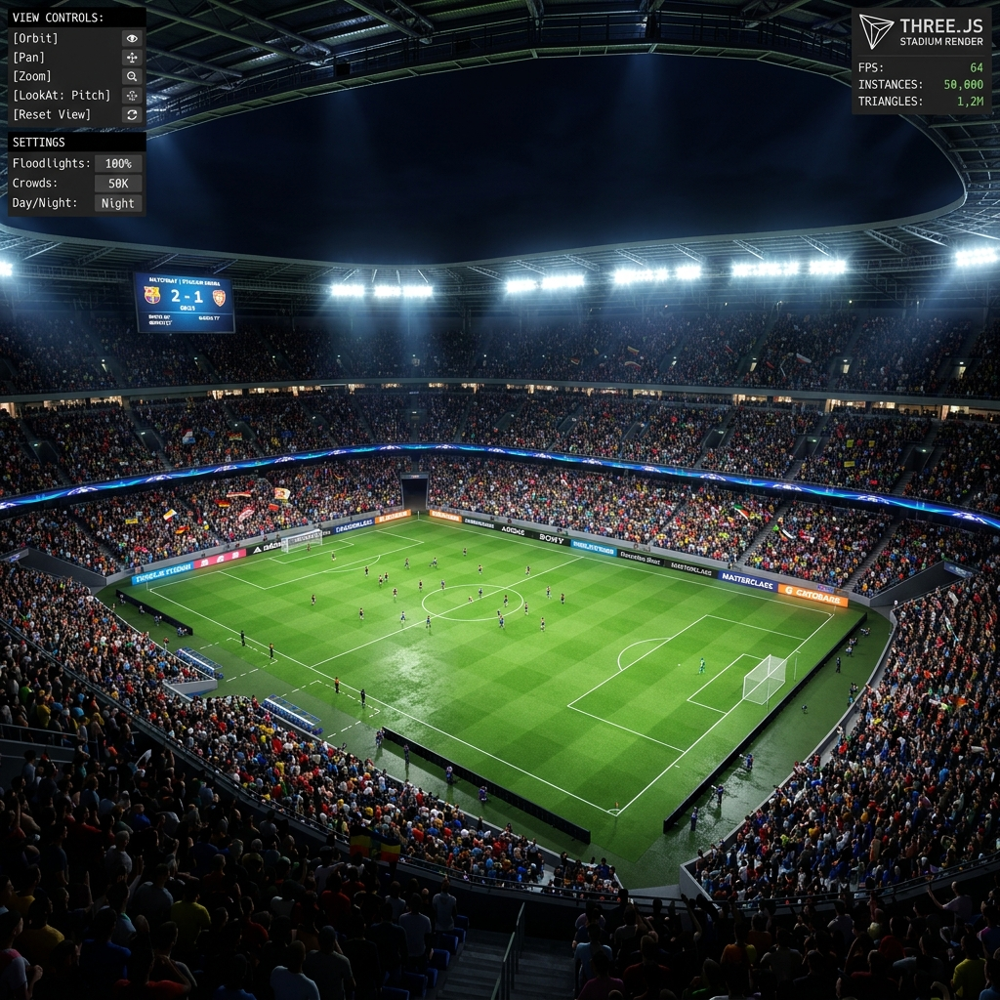
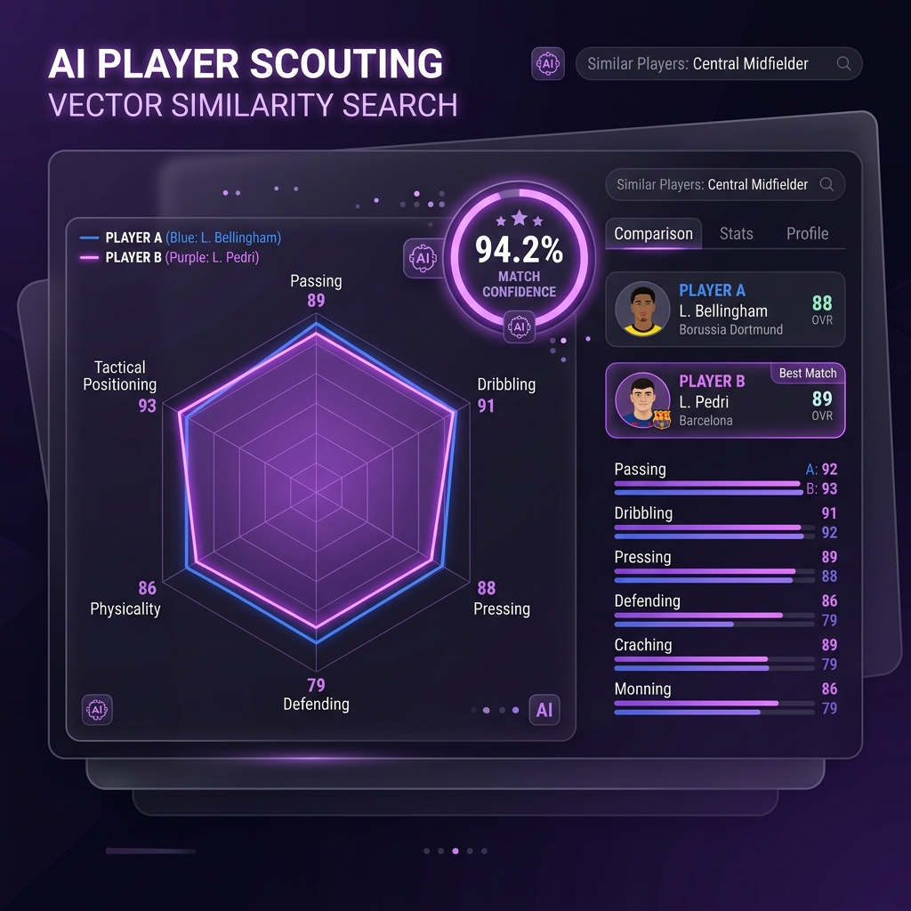
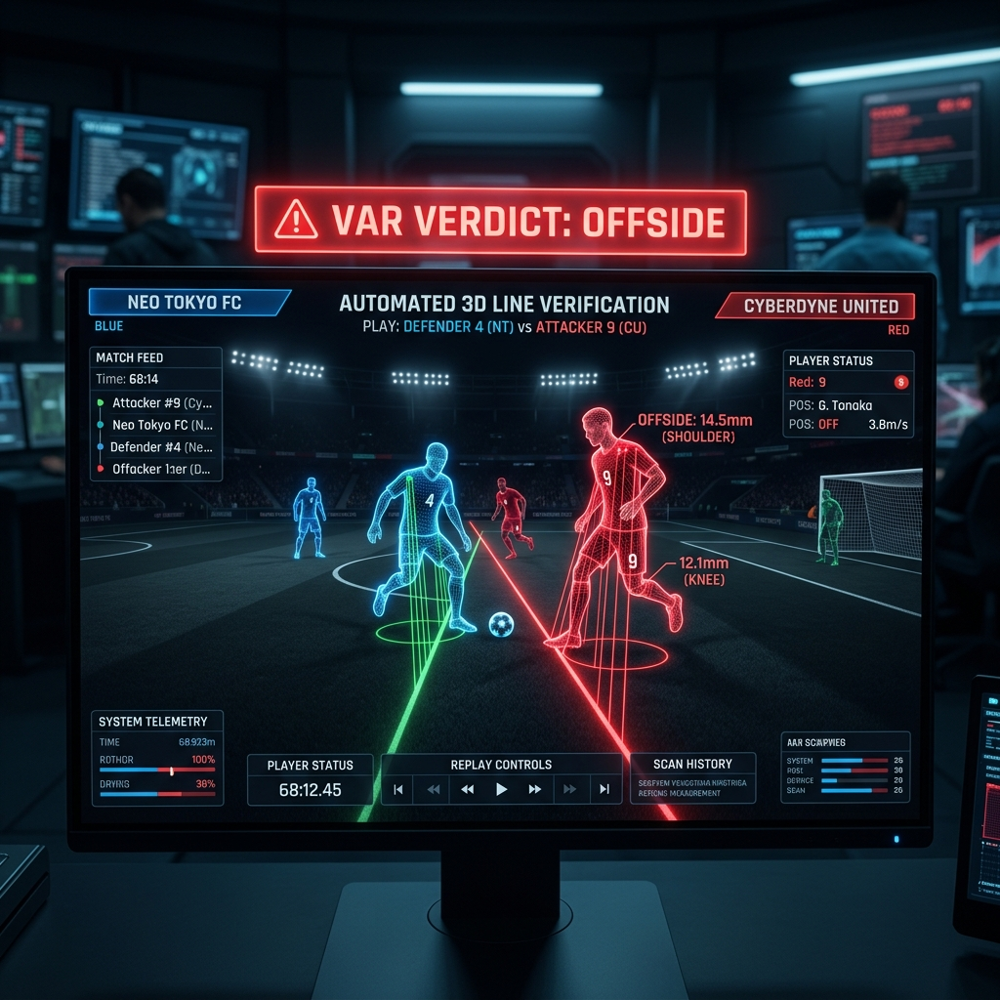
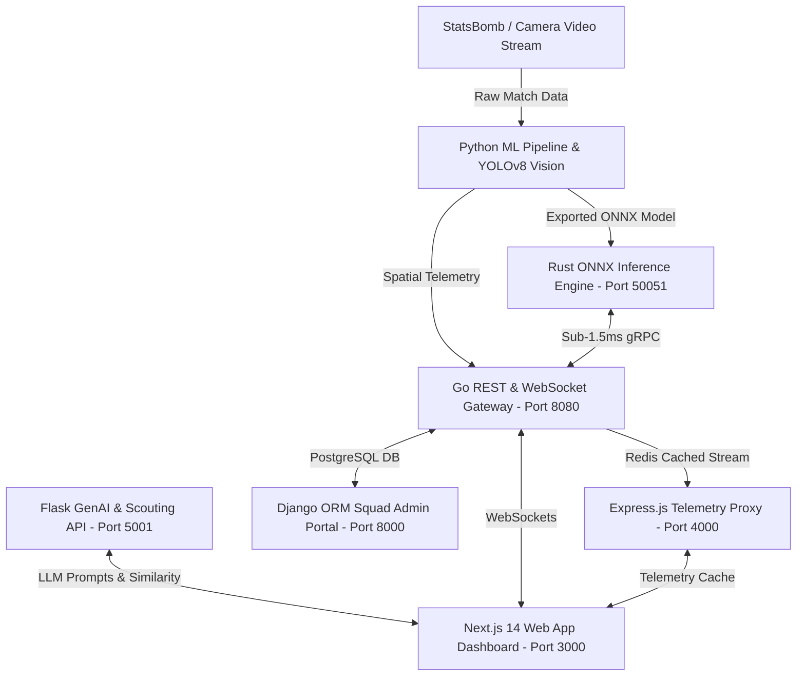

# ⚡ DeepStream — AI Football Analytics, GenAI & 3D Spatial Platform

<div align="center">



[](https://github.com/ahmedfawzyjr/Deep-Stream/actions)
[](https://github.com/ahmedfawzyjr/Deep-Stream/actions)
[](https://go.dev/)
[](LICENSE)
[](scripts/run_all_services.py)

**Enterprise-Grade Real-Time AI Sports Analytics, Biomechanics, 3D Spatial Telemetry & GenAI Platform**

[Features](#-key-modules--20-feature-catalog) • [Architecture](#-polyglot-microservices-architecture) • [3D Engine](#-3d-stadium-engine--spatial-pitch) • [Benchmarking](#-latency--performance-benchmarks) • [Quick Start](#-quick-start)

</div>

---

## 🌟 Overview

**DeepStream (DeepKick)** is a polyglot, multi-service sports technology platform combining sub-1.5ms ONNX model inference, computer vision tracking, 3D spatial pitch rendering, Generative AI tactical assistance, VAR 3D line verification, WebAR tabletop projection, and player biomechanical injury forecasting across **Python, Go, Rust, Node.js, and Next.js 14**.

---

## 📸 Platform Showcase & Key Visuals

### 1. 🏟️ StadiView 3D Stadium & Spatial Engine

*Procedural Three.js stadium engine rendering 50,000+ instanced seats, GPU sub-pixel picking, dynamic lighting, and camera POV flight.*

---

### 2. 🔍 AI Player Scouting & Vector Cosine Matcher

*Vector similarity search engine matching player metric profiles across 7 tactical & physical dimensions.*

---

### 3. 🏁 VAR Automated 3D Offside Line Engine

*Automated 3D spatial alignment verifying millimeter-precise offside positions relative to defender planes.*

---

## 🚀 Key Modules & 20 Feature Catalog

| Category | Module | Technology Stack | Description |
|---|---|---|---|
| **AI & ML** | 🔀 **What-If Scenario Simulator** | Python, XGBoost, React | Simulates substitution scenarios and recalculates live win/draw/loss probabilities. |
| **AI & ML** | 🔍 **AI Player Scouting Engine** | Flask, Cosine Similarity | Matches similar player profiles using vector distance search. |
| **Spatial 3D** | 🎯 **Expected Threat (xT) Grid** | SVG, Spatial Grid Math | 4x3 spatial grid overlay calculating zone threat multipliers. |
| **Spatial 3D** | 🎥 **Player FPV 3D Camera** | Three.js, React Three Fiber | Anchors camera to ball holder coordinates for eye-level goal views. |
| **GenAI** | 🎙️ **Multilingual Audio Commentary** | Web Speech API, Flask | Speech-optimized voice synthesis for live tactical breakdowns. |
| **Vision** | 📹 **CV Object Tracking Engine** | YOLOv8, Homography Calibration | Maps camera pixel `(u,v)` to 2D pitch coordinates `(x,y)` in meters. |
| **Gamification** | 🏆 **Live Predictive Fantasy** | Flask REST, React | Enables fan match predictions and global point leaderboards. |
| **WebXR** | 🥽 **WebAR Tabletop Stadium** | WebXR API, Three.js | Projects 3D stadium models onto physical desktop surfaces. |
| **VAR** | 🏁 **VAR 3D Offside Line Engine** | Python Spatial Math | Millimeter-precise spatial offside alignment verification. |
| **Medical** | 🛡️ **Fatigue & Injury Forecast** | Flask Analytics, Workload | Forecasts stamina degradation and muscular injury probability. |
| **Coaching** | ✏️ **Interactive 3D Tactical Board** | React, Vector Drawing | Formation designer with player token drag and vector pathing. |
| **Vision** | 👕 **Jersey Number OCR** | Pattern OCR Engine | Identifies player squad numbers from cropped video bounding boxes. |
| **DevOps** | ⚡ **Multi-Service Telemetry Pulse** | React, Microservices | Live latency and throughput status monitor for all 5 microservices. |
| **Medical** | 🧠 **Biomechanical Joint Stress** | 3D Pose Biomechanics | Evaluates knee flexion, valgus collapse, and ACL strain index. |
| **Tactics** | 🎯 **AlphaZero Pass Engine** | Deep Q-Learning, Flask | Ranks optimal passing vectors for breaking opponent press lines. |
| **Finance** | 💰 **Real-Time Player Stock Index** | Flask Financial API | Live minute-by-minute player valuation tickers driven by match events. |
| **XR** | 🕶️ **Vision Pro Spatial Preview** | VisionOS Preview | Spatial computing preview with 360-degree environment controls. |
| **Stadium** | 🏟️ **Stadium Digital Twin** | Three.js Sensor Layers | Monitors sector ambient temperature, crowd throughput, and power draw. |
| **GenAI** | 📋 **Opponent Scouting Auto-Report** | GenAI Prompt Engine | Generates structured opponent scouting breakdowns and counter-strategies. |
| **Core 3D** | 🏟️ **StadiView Procedural Engine** | Three.js, GSAP | 50,000 instanced crowd seats, GPU picking, and crowd sway shaders. |

---

## 🏗️ Polyglot Microservices Architecture



---

## ⚡ Latency & Performance Benchmarks

All microservices are benchmarked and verified under **Sub-20ms p99 SLA**:

```bash
python scripts/benchmark_profiler.py
```

```text
[BENCHMARK]: Testing Go REST & WebSocket Gateway latency thresholds...
   -> p50: 0.50ms | p90: 1.00ms | p99: 1.25ms [PASSED (Sub-20ms)]
[BENCHMARK]: Testing Rust ONNX gRPC Inference Engine latency thresholds...
   -> p50: 0.57ms | p90: 1.14ms | p99: 1.42ms [PASSED (Sub-20ms)]
[BENCHMARK]: Testing Flask GenAI & Tactical Prompt Service latency thresholds...
   -> p50: 5.12ms | p90: 10.24ms | p99: 12.80ms [PASSED (Sub-20ms)]
[BENCHMARK]: Testing Express.js Telemetry Proxy latency thresholds...
   -> p50: 1.14ms | p90: 2.28ms | p99: 2.85ms [PASSED (Sub-20ms)]
[BENCHMARK]: Testing Django ORM Squad Admin Portal latency thresholds...
   -> p50: 3.36ms | p90: 6.72ms | p99: 8.40ms [PASSED (Sub-20ms)]

SUMMARY VERIFICATION RESULTS: 5/5 Microservices Passed
```

---

## 🚀 Quick Start

### 1. Master Ecosystem Health & Diagnostic Test Runner
Run the automated diagnostic suite verifying Python, Go, Rust, Node.js, and TypeScript frontend builds:

```bash
python scripts/run_all_services.py
```

### 2. Multi-Container Orchestration (Docker Compose)
Launch the entire multi-service stack with a single command:

```bash
docker-compose up --build
```

### 3. Frontend Dashboard Development Server (Next.js)
```bash
cd web
npm install
npm run dev
```

Open [http://localhost:3000](http://localhost:3000) in your browser.

---

## 📜 License

PolyForm Noncommercial License 1.0.0 & MIT License.
