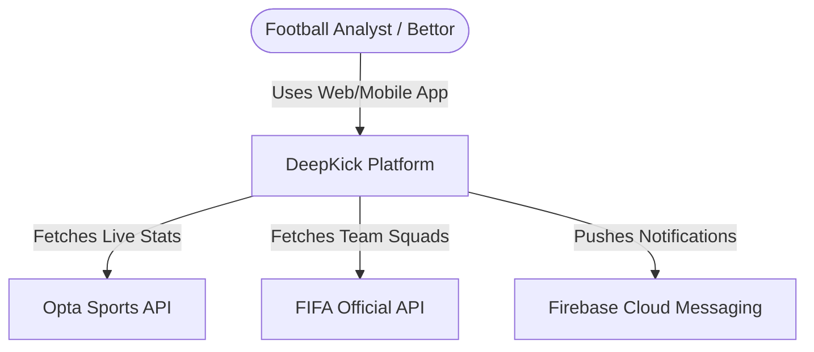
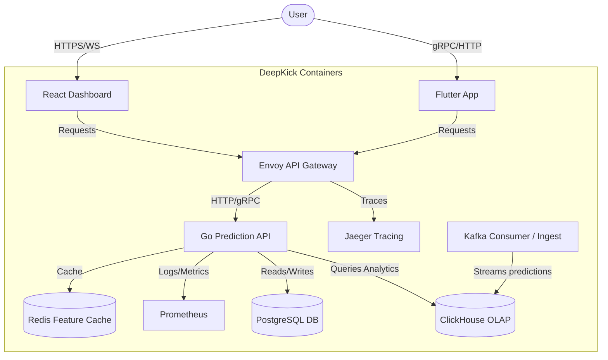
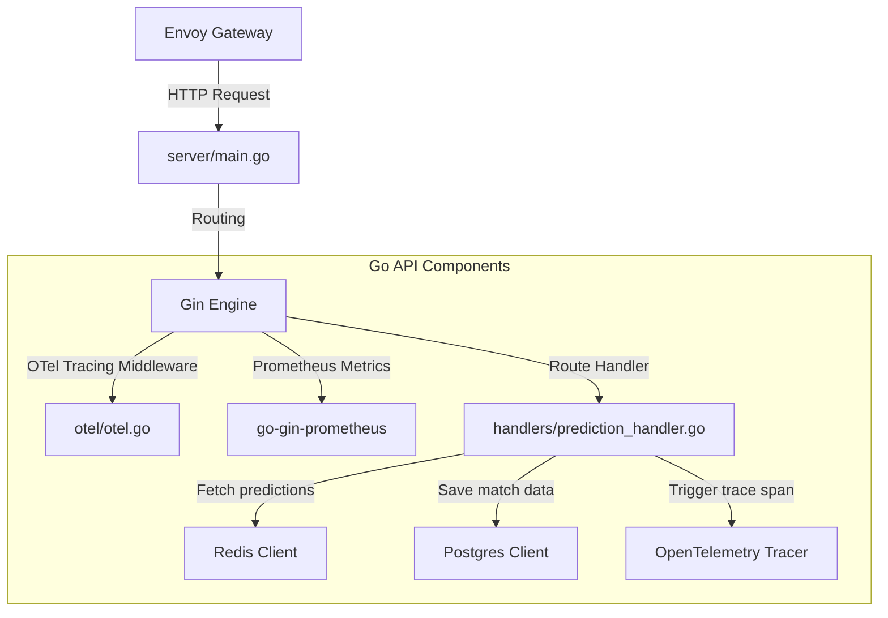

# C4 Architectural Diagrams

This document contains C4 architecture diagrams mapping out DeepKick's distributed system layers.

## Level 1: System Context Diagram

## Level 2: Container Diagram

## Level 3: Component Diagram (Go API Gateway)

