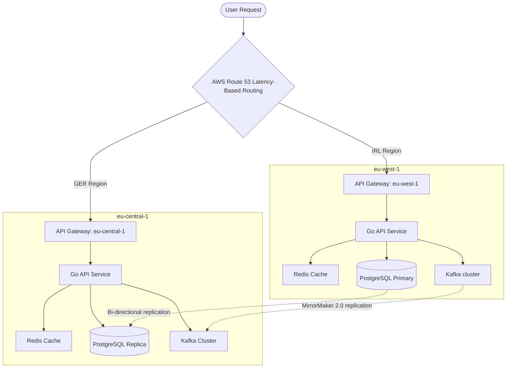

# Multi-Region Deployment & Failover Architecture

DeepKick targets a highly available, low-latency deployment distributed across three primary AWS regions:
- **eu-west-1 (Ireland)** - Primary Hub
- **eu-central-1 (Germany)** - Secondary Active Hub
- **eu-west-3 (France / Netherlands Edge)** - Failover and Edge cache

## Architecture Overview

## 1. Database & Feature Store Replication
- **PostgreSQL**: Configured with active-passive replication. Writes are routed to `eu-west-1` and asynchronously mirrored to `eu-central-1` with automated promotion (failover) in under 10 seconds via patroni orchestrator.
- **ClickHouse (Analytics)**: Distributed tables using ClickHouse Keeper for replication across both regions.
- **Redis (Feature Cache)**: Redis Global Datastore is used to maintain synchronized cache states for prediction and player form retrieval with `<5ms` cross-region lag.

## 2. Event Stream Replication
- **Apache Kafka (MirrorMaker 2.0)**: Live sports events ingested into `eu-west-1` Kafka brokers are replicated in real-time to the `eu-central-1` cluster. If one cluster fails, consumers switch partition offsets seamlessly.

## 3. Disaster Recovery & SLOs
- **RTO (Recovery Time Objective)**: `< 15 seconds` for automated DNS failover via AWS Route 53 Health Checks.
- **RPO (Recovery Point Objective)**: `< 2 seconds` for data synchronization between regional replication streams.
